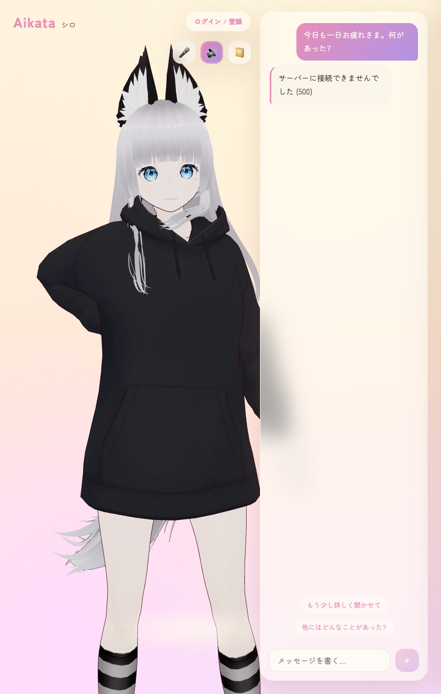
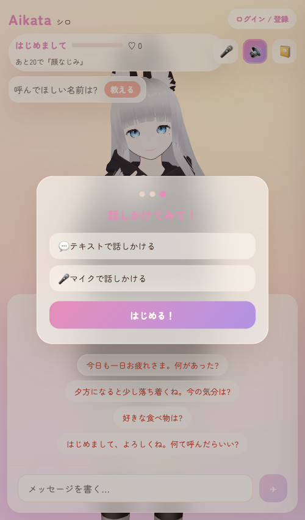
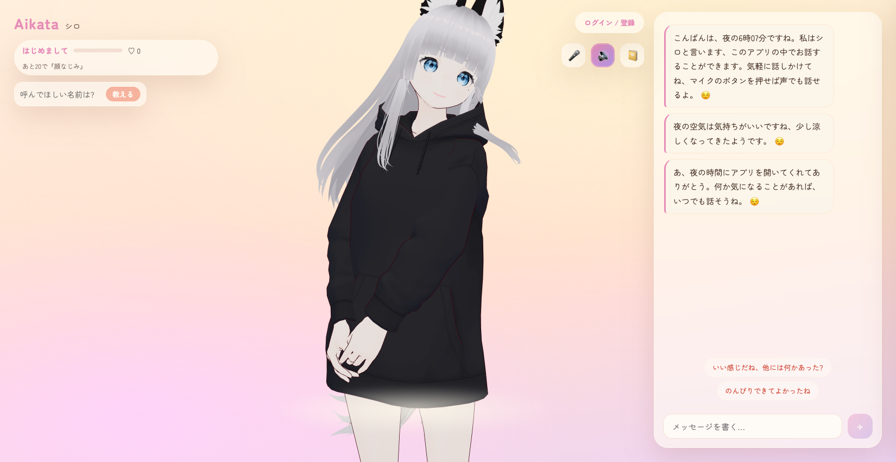

# V-Mate (vメイト) — 3D AI コンパニオン「シロ」

パソコンの中に住む相棒「シロ」と話せる 3D AI コンパニオン。
Web ブラウザと iOS の両方から利用でき、音声会話・永続記憶・親密度システムを備える。

## スクリーンショット

### Web メイン画面


### UI デザイン


### 現在のアプリ状態


## 機能

| 機能 | 説明 |
|------|------|
| 音声会話 | マイクで話しかけるとシロが音声で応答。ハンズフリーで連続会話が可能 |
| オンデバイス STT | 音声認識をデバイス内で処理。iOS は SFSpeechRecognizer、Web は Whisper (Transformers.js) |
| 永続記憶 | 会話からユーザーの事実を自動抽出し、以後の会話に反映 (SQLite) |
| 親密度システム | 会話で親密度が上昇。5段階で口調・距離感が変化 (敬語→タメ口→相棒) |
| シロの日記 | その日の会話を振り返ってシロが日記を書く |
| 自発的な声かけ | 起動時の挨拶 + 放置すると時間帯・記憶を踏まえた一言 |
| 感情表現 | `[happy]` 等のタグ → VRM 表情 + モーション切替 + まばたき + 視線追従 |
| リップシンク | Aivis Cloud API で音声合成。音量解析で口が動く |

## 対応プラットフォーム

| プラットフォーム | ステータス | 技術 |
|-----------------|-----------|------|
| **Web ブラウザ** | ✅ 利用可能 | Vite + React + three.js + @pixiv/three-vrm |
| **iOS アプリ** | 🚧 開発中 | Swift + SwiftUI + SFSpeechRecognizer |

iOS 版はネイティブ実装で、オンデバイス音声認識を活用したハンズフリー会話に対応予定です。

## アーキテクチャ

```
ブラウザ/iOS ──▶ Cloudflare Worker (aikata)
                  ├─ /api/*        → Worker (TypeScript)
                  ├─ それ以外       → ASSETS (Vite ビルド済みフロント)
                  ├─ D1 (SQLite)   → 会話/記憶/日記/アカウント/レート制限
                  └─ fetch ──▶ Groq (LLM) / Aivis Cloud API (TTS)
```

| レイヤー | 技術 | 備考 |
|---------|------|------|
| **本番 API** | Cloudflare Workers + D1 | 無料・永続。TypeScript 実装 |
| **ローカル開発 API** | FastAPI + SQLite | Python。`worker/` と機能等価 |
| **Web フロントエンド** | Vite + React + three.js + @pixiv/three-vrm | VRM 表示・UI |
| **iOS アプリ** | Swift + SwiftUI + SFSpeechRecognizer | ネイティブ。オンデバイス音声認識 |
| **LLM** | Groq (OpenAI 互換) | 無料枠。`LLM_BASE_URL` で他サービスに切替可 |
| **TTS** | Aivis Cloud API | クラウド音声合成。キー未設定時は無音 |

## プロジェクト構成

```
v-mate/
├── worker/          Cloudflare Workers (本番 API + 静的アセット配信)
├── backend/         FastAPI (ローカル開発・研究用の参照実装)
├── frontend/        Vite + React (Web フロントエンド)
├── ios/             iOS ネイティブアプリ (Xcode)
├── dev-notes/       開発ノート・調査記録
└── .loop/           開発ループの状態管理
```

## セットアップ

### ローカル開発 (Web)

```bash
# バックエンド
cd backend
python3 -m venv .venv
.venv/bin/pip install -r requirements.txt
cp .env.example .env   # LLM_API_KEY を記入

# フロントエンド
cd ../frontend
npm install
npm run build          # backend/static/ に出力

# 起動
cd ../backend
../start.sh            # → http://localhost:8080
```

開発時はフロントを別途起動: `cd frontend && npm run dev` (http://localhost:5173)

### iOS

```bash
cd ios
open VMate.xcodeproj
# Xcode でビルド・実行
```

### 本番デプロイ (Cloudflare)

```bash
cd worker
npm install
npx wrangler deploy
```

手順の詳細は [`worker/DEPLOY.md`](worker/DEPLOY.md) を参照。

## 設定

### バックエンド (backend/.env)

| 変数 | 説明 |
|------|------|
| `LLM_API_KEY` | **必須**。LLM の API キー (既定 Groq) |
| `LLM_BASE_URL` | 既定 `https://api.groq.com/openai/v1` |
| `LLM_MODEL` | 既定 `llama-3.3-70b-versatile` |
| `AIVIS_API_KEY` | 音声合成用。未設定なら無音 |
| `AIVIS_MODEL_UUID` | 声の指定 |

### Worker (worker/wrangler.toml)

| 変数 | 説明 |
|------|------|
| `LLM_API_KEY` | Groq の API キー |
| `AIVIS_API_KEY` | 音声合成用 (任意) |

## 音声認識 (STT)

### iOS — SFSpeechRecognizer

iOS 版は Apple の `SFSpeechRecognizer` を使用し、オンデバイス認識を優先する。
iOS 17 以降の iPhone では日本語モデルが自動ダウンロードされ、ネットワーク往復なしで認識が完結する。

- オンデバイス認識が失敗した場合、そのセッション中はサーバー認識にフォールバック
- セッション再開時にオンデバイス認識を再試行
- 詳細: [`ios/VMate/Sources/Audio/SpeechRecognizer.swift`](ios/VMate/Sources/Audio/SpeechRecognizer.swift)

### Web — Transformers.js + Whisper

Web 版は `@huggingface/transformers` の Whisper-tiny モデルを使用し、ブラウザ内で音声認識を行う。
音声データは一切外部サーバに送信されない。

- 初回はモデル (~75MB) をダウンロード。以降は IndexedDB にキャッシュ
- WebGPU 対応環境では GPU 加速
- モデル読み込み失敗時は Web Speech API にフォールバック
- 詳細: [`frontend/src/features/voice/whisper-engine.ts`](frontend/src/features/voice/whisper-engine.ts)

## データ

会話・記憶・日記・親密度はすべて SQLite にローカル保存。

- ローカル: `backend/data/aikata.db`
- 本番: Cloudflare D1

## ライセンス

未定
